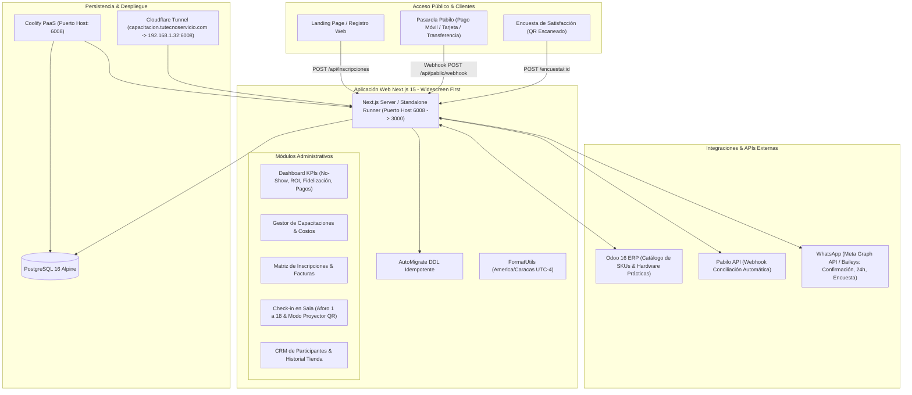

# Mapa Conceptual y Arquitectura del Sistema: Onprotec Capacitaciones

Este documento sirve como la **guía de supervivencia técnica y funcional** para la aplicación web de gestión, control de aforo, finanzas e integraciones de la **Sala de Capacitaciones de Onprotec C.A.**

---

## 1. Título y Propósito

* **Aplicación:** Onprotec Capacitaciones (Control de Aforo, CRM y Rentabilidad de Formación Técnica).
* **Propósito:** Centralizar el registro público de participantes, la validación automática de pagos (Pabilo), el control del aforo físico limitado de la sala (**aforo máximo estricto: 18 participantes + 1 instructor en tarima**), la gestión de lista de espera prioritaria, el cálculo de rentabilidad financiera (ROI), el mapa de conversión/fidelización de clientes frente a compras de hardware en tienda (Odoo ERP) y el check-in en tiempo real con encuestas de satisfacción generadas por código QR.

---

## 2. Arquitectura General y Tecnologías

```mermaid
flowchart TD
    subgraph Publico [Acceso Público & Clientes]
        Landing["Landing Page / Registro Web"]
        PabiloPay["Pasarela Pabilo (Pago Móvil / Tarjeta / Transferencia)"]
        SurveyQR["Encuesta de Satisfacción (QR Escaneado)"]
    end

    subgraph Core [Aplicación Web Next.js 15 - Widescreen First]
        AppServer["Next.js Server / Standalone Runner (Puerto Host 6008 -> 3000)"]
        AutoMigrate["AutoMigrate DDL Idempotente"]
        FormatUtils["FormatUtils (America/Caracas UTC-4)"]
        
        subgraph ModulosAdmin [Módulos Administrativos]
            DashboardKPIs["Dashboard KPIs (No-Show, ROI, Fidelización, Pagos)"]
            CapacitacionesMgr["Gestor de Capacitaciones & Costos"]
            InscripcionesMgr["Matriz de Inscripciones & Facturas"]
            CheckinMgr["Check-in en Sala (Aforo 1 a 18 & Modo Proyector QR)"]
            ParticipantesCRM["CRM de Participantes & Historial Tienda"]
        end
    end

    subgraph Integraciones [Integraciones & APIs Externas]
        OdooERP["Odoo 16 ERP (Catálogo de SKUs & Hardware Prácticas)"]
        PabiloAPI["Pabilo API (Webhook Conciliación Automática)"]
        WhatsAppAPI["WhatsApp (Meta Graph API / Baileys: Confirmación, 24h, Encuesta)"]
    end

    subgraph Database [Persistencia & Despliegue]
        PostgresDB[(PostgreSQL 16 Alpine)]
        Coolify["Coolify PaaS (Puerto Host: 6008)"]
        CloudflareTunnel["Cloudflare Tunnel (capacitacion.tutecnoservicio.com -> 192.168.1.32:6008)"]
    end

    Landing -->|POST /api/inscripciones| AppServer
    PabiloPay -->|Webhook POST /api/pabilo/webhook| AppServer
    SurveyQR -->|POST /encuesta/:id| AppServer
    
    AppServer --> AutoMigrate
    AppServer --> PostgresDB
    AppServer <--> OdooERP
    AppServer <--> PabiloAPI
    AppServer <--> WhatsAppAPI
    
    Coolify --> AppServer
    Coolify --> PostgresDB
    CloudflareTunnel --> AppServer
```

### Stack Técnico:
* **Framework:** Next.js 15 (App Router) con TypeScript y modo `standalone` para Docker.
* **Base de Datos & ORM:** PostgreSQL 16 con Drizzle ORM (`drizzle-orm` + `pg`).
* **Auto-Migraciones:** Script `src/lib/autoMigrate.ts` idempotente (`CREATE TABLE IF NOT EXISTS`, `ALTER TABLE ... ADD COLUMN IF NOT EXISTS`).
* **Estilos & Diseño:** Tailwind CSS con paleta Onprotec Navy/Cyan/Blue y arquitectura Widescreen-First.
* **Zona Horaria:** `America/Caracas` (UTC-4) obligatoria vía `src/utils/formatUtils.ts`.
* **Despliegue:** Dockerfile multi-stage (Node 22-alpine), `docker-compose.yml`, Coolify y Cloudflare Tunnel.

---

## 3. Características Globales y Filosofía UX/UI

1. **Widescreen-First, Hero Centrado & Grid Dinámico de Banners por Capacitación:**
   * En pantallas de escritorio (1080p, 1440p, laptops), la información de primer nivel y métricas críticas se presentan con alta legibilidad y flujo visual directo sin duplicidades.
   * **Hero Corporativo Centrado (`max-w-4xl mx-auto`):** Encabezado ejecutivo limpio centrado con altura compacta (`py-7 lg:py-9`) para mostrar de inmediato la propuesta de valor de la Sala Técnica VIP OnProtec y permitir que los banners de selección queden visibles desde el primer pantallazo.
   * **Banners Individuales por Cada Capacitación Activa en `#registro-express`:**
     * Muestra un banner dedicado por **cada capacitación activa** (`Planificado` / `En Publicidad`), adaptando las columnas del grid automáticamente (`grid-cols-1`, `md:grid-cols-2` o `lg:grid-cols-3`) cuando hay 1, 2, 3 o más convocatorias simultáneas.
     * **Medida Oficial de Banners (`1080px × 550px`):** Tanto los banners superiores de selección como la vista destacada de la ficha izquierda renderizan la **foto llamativa a todo color (`opacity-100`)** con relación de aspecto oficial **`aspect-[1080/550]` (`1080px × 550px`)**, acompañada de una barra superior flotante con código, marca, `✓ SELECCIONADO` e inversión/gratuidad y orientación explícita de diseño en `/admin/capacitaciones`.
     * **Orden Configurable Drag-and-Drop (`displayOrder`):** Desde `/admin/capacitaciones`, el equipo administrativo puede arrastrar las filas de capacitación (o usar `↑`/`↓`) para definir el orden exacto de visualización (`PUT /api/capacitaciones` con `action: "reorder"`), reflejándose en vivo en la posición de los banners y el curso preseleccionado en la portada.
     * Su bloque inferior sólido (`#0b0e17`) muestra el título blanco de alto contraste, fecha, horario Caracas, instructor y etiqueta uniforme **`Aforo: 18 puestos`** (sin mostrar textos de 40 cupos libres).
     * **Botones Unificados y Enfoque Directo:** Todos los banners incorporan al pie el botón *"✍️ Clic para llenar formulario • [Marca/Código] ↓"*. Al hacer clic, selecciona esa capacitación, actualiza la foto destacada y temario de la ficha izquierda, desplaza fluidamente hacia `#formulario-oficial` y enfoca `#input-participant-name`.
     * **En la Cabecera del Formulario (`#formulario-oficial`):** Indica qué curso se está completando e incorpora botones de cambio rápido hacia todas las demás capacitaciones abiertas.
     * **Soporte de Campañas de Marketing por URL:** Reconoce parámetros de enlace para anuncios (`/?curso=ezviz`, `/?curso=dahua`, `/?id=39`, `/?id=40`, `/?id=41`), cargando automáticamente la capacitación y el formulario respectivo.
   * **Prioridad Visual por Orden Manual (`displayOrder`) o EZVIZ por Defecto:** Si existe un orden manual configurado desde `/admin/capacitaciones`, los banners de la portada siguen estrictamente ese orden; en caso contrario, la certificación oficial EZVIZ (`CAP-2026-039`) se posiciona de primera seguida cronológicamente por fecha.
   * **Blindaje Anti-Colisión en Banners (`.dark-banner-card`):** La clase `.dark-banner-card` y sus reglas dedicadas en `globals.css` garantizan texto blanco (`#ffffff`), horario cian (`#67e8f9`) y badges de inversión (`#090d16` sobre `.bg-amber-400`/`.bg-emerald-400`) con contraste perfecto tanto en Modo Claro como en Modo Oscuro.
   * La Landing Page pública funciona como la **carta de presentación ejecutiva de la Sala de Capacitaciones OnProtec**, con layout split-view inferior (7 cols ficha técnica/temario, 5 cols formulario oficial con comprobante de pago).
   * Cintillo de navegación fijo (`sticky top-0 z-50`) con marca oficial única y acceso administrativo seguro.
   * Se reorganiza a flujo vertical amigable únicamente en dispositivos móviles o tablets (`max-width: 768px`).

2. **Autenticación Administrativa & Usuario Master Principal:**
   * **Portal Administrativo Protegido (`/admin/*`):** El acceso al panel administrativo está 100% blindado mediante solicitud de usuario/correo corporativo y contraseña con tokens criptográficos de sesión HTTP-only.
   * **Usuario Master Principal:** `juan@onprotec.com` (o usuario `juan`) con contraseña `5197148` y rol `Super Admin Master`, con acceso total a métricas, finanzas, edición/eliminación de cursos y gestión de credenciales.
   * **Seguridad Visual Reforzada:** Se eliminaron las cajas de contraseñas visibles en texto plano, reemplazándolas por políticas corporativas de seguridad y campos con enmascaramiento seguro y conmutador de visibilidad.
   * **Comunicaciones Oficiales:** Todos los mensajes de confirmación y botones de WhatsApp se dirigen al *"Equipo de OnProtec"*, garantizando una voz institucional uniforme.

3. **Control de Contraste y Modos de Color (Dark/Light):**
   * Configuración de Tailwind `darkMode: "class"` controlada por selector explícito en `<html>` (`.dark` / `[data-theme]`), evitando que sistemas operativos en modo oscuro fuercen clases oscuras sobre vistas claras.
   * Regla de Alto Contraste en Modo Claro: Textos oscuros (`#0f172a`, `#1e293b`, `#475569`) sobre fondos blancos/grises, garantizando máxima legibilidad en todas las vistas administrativas (Directorio de Participantes, Gestor de Capacitaciones, Check-in).
   * Regla de Alto Contraste en Modo Oscuro: Textos secundarios iluminados a `#cbd5e1`, placeholders de inputs a `#94a3b8`, etiquetas a `#f8fafc`, y superficies con fondos oscuros profundos `#111526` y `#0b0e17`.

4. **Horarios Locales Respetados (America/Caracas):**
   * Todas las fechas de eventos, aperturas de publicidad, confirmaciones 24h y timestamps de check-in se guardan en UTC en base de datos pero se renderizan forzosamente en `America/Caracas` (UTC-4) mediante `fmtLocalTime` y `fmtLocalDate`.

5. **Blindaje de Enlaces y Manejo Amigable de Errores 404:**
   * Redirecciones automáticas en `next.config.mjs` para URLs comunes o aliases tecleados por usuarios (`/capacitacion`, `/capacitaciones`, `/inscripcion`, `/registro`, `/cursos`, `/encuesta`) hacia `/` o `/#registro-express`.
   * Página `src/app/not-found.tsx` estilizada con la identidad corporativa OnProtec y botón de retorno inmediato.

---

## 4. Detalle por Módulos y Lógica de Negocio

### A. Control de Aforo, Privacidad y Gestión de Cupos
* **Sede Oficial y Política de Privacidad de Ubicación:**
  * **Ubicación Física Real:** **Torre América, Piso 14, Urbanización El Recreo, Caracas, Venezuela** (gestionable y editable en panel privado).
  * **Resguardo Público:** En la landing page pública **se oculta la dirección exacta y piso** para prevenir la llegada de personas no inscritas ni invitadas. Se presenta como *"Sede Corporativa OnProtec (Caracas)"*, informando al usuario que la dirección detallada y coordenadas se despachan por WhatsApp tras confirmar su invitación o pago.
* **Aforo Físico de Sala:** Capacidad física máxima estricta de **18 puestos para participantes** y **1 puesto para el instructor**.
* **Lógica Dual de Aforo OnProtec (Gratuito vs. Cobrado):**
  1. **Presentaciones Gratuitas (`isFree = true`):**
     * Meta de pre-inscripción ampliada de **30 hasta 40 participantes**.
     * Esta holgura permite al equipo de OnProtec contactar y reconfirmar telefónicamente a los **18 asistentes presenciales finales**, mitigando el No-Show habitual de los eventos sin costo.
     * Solo si la pre-inscripción supera los 40 registros entra en estado **`Lista de Espera`**.
     * **Confirmación Post-Envío:** Informa claramente que el participante está **Pre-inscrito**, explicando que se realiza una preselección de asistentes para garantizar la rotación y diversidad de técnicos en sala antes de remitir la invitación formal.
  2. **Actividades Cobradas / Pagas (`isFree = false` o `price > 0`):**
     * Aforo estricto de **solo 18 puestos VIP garantizados** (en la interfaz pública todas las fichas muestran únicamente `Aforo: 18 puestos`).
     * **Métodos de Pago Alineados por Curso, Calculados en Bs. (API BCV) y Validación Dual:**
       * **Control Estricto de Asignación (`paymentMethods`):** El formulario público muestra **únicamente** los métodos habilitados por curso desde `/admin/capacitaciones` (ya no fuerza métodos desactivados como Pago Móvil en cursos donde no está marcado), dispuestos horizontalmente **en una sola línea** mediante grid proporcional `grid-flow-col` con tarjetas e iconos SVG alusivos.
       * **Binance (`Binance (Pabilo)` / `Binance`):** Exige validación electrónica en tiempo real hacia la cuenta oficial **Onprotec Binance (`Binance ID: 1076181690`, `pabilo_id: 6a8628f7ea21f60026765c37`)** por el monto exacto en USD/USDT de la capacitación vía `POST /api/pabilo/verify` $\rightarrow$ `POST https://api.pabilo.app/userbankpayment/6a8628f7ea21f60026765c37/betaserio` (cabecera `appKey`). Bloqueo estricto en UI (`src/app/page.tsx`) y backend (`POST /api/inscripciones`) si `status !== "paid"` o si la referencia/`payment_id` ya fue consumida (control Anti-Replay). Genera token HMAC-SHA256 y nace confirmada (`isPaid: true`, `pabiloStatus: "approved"`, `status: "Confirmado"`), siendo el adjunto de comprobante opcional.
       * **Zelle USD (`zelle@onprotec.com`) / Pago Móvil (`Banesco · V15871667 · 04126087854`) / Transferencia Bancaria Bs (Manual):** Al seleccionar **Zelle USD**, se muestra **`zelle@onprotec.com`** con botón `Copiar Correo`. Al seleccionar **Pago Móvil** o **Transferencia Bs**, el cliente consulta en tiempo real la **Tasa Oficial BCV del día** (`GET /api/bcv` vía `ve.dolarapi.com/v1/dolares/oficial` con respaldos automáticos) para **calcular y mostrar el monto exacto en Bolívares (`Bs.`)** con botón `Copiar Monto Bs`, además de los datos receptores (**`Banco: Banesco`**, **`Cédula: V15871667`**, **`Teléfono: 04126087854`**). Todos exigen referencia de transacción (`>= 4` caracteres) y carga obligatoria del comprobante de pago (`paymentProofUrl`), quedando registrados con `isPaid: false`, `pabiloStatus: "pending"` y `status: "Inscrito"` para verificación administrativa en `/admin/inscripciones`.
       * **Efectivo en Tienda OnProtec:** Disponible únicamente cuando faltan más de 48 horas para el evento (aviso preventivo de plazo 48h en taquilla).
* **Validación Anti-Duplicados:**
  * El sistema valida mediante normalización de caracteres que ningún número de Cédula o RIF (o correo electrónico) se registre más de una vez en la misma capacitación activa. Retorna error `409 Conflict` con indicaciones claras para contactar al equipo de OnProtec vía WhatsApp si requiere gestionar su registro.
* **Edición Directa y Completa de Formularios para Coordinación (Diana):**
  * Desde la tabla de `/admin/capacitaciones`, el botón directo **`📝 Editar Formulario`** abre el editor directamente en la pestaña 3 (`formulario`), permitiendo editar título (`formQuestionsTitle`), descripción (`formQuestionsDescription`), preguntas personalizadas de todos los tipos (`text`, `textarea`, `select`, `radio`, `checkbox`, `file`) —todos renderizados en `src/app/page.tsx`— y los métodos de pago habilitados (`Binance (Pabilo)`, `Zelle USD`, `Pago Móvil`, `Transferencia Bancaria Bs`, `Efectivo en Tienda OnProtec`).
* **Condición de Sobrecupo y Lista de Espera:**
  $$\text{Ocupación Activa} = \text{Inscritos} + \text{Confirmados} + \text{Asistió}$$
  * Si $\text{Ocupación Activa} < \text{Capacidad Efectiva}$ (18 para pagos, 40 para gratuitos): Estado **`Inscrito`**.
  * Si $\text{Ocupación Activa} \ge \text{Capacidad Efectiva}$: Estado **`Lista de Espera`**.

### B. Funnel de Asistencia y Tasa de No-Show
* **Fórmula de Tasa de No-Show:**
  $$\text{Tasa No-Show (\%)} = \left(\frac{\text{No Asistió}}{\text{Confirmados}}\right) \times 100$$
* **Fórmula de Asistencia Efectiva:**
  $$\text{Asistencia Efectiva (\%)} = \left(\frac{\text{Asistió}}{\text{Confirmados}}\right) \times 100$$
* **Flujo Operativo:**
  1. Inscrito en landing web.
  2. Disparo de WhatsApp 24 horas antes solicitando confirmación.
  3. Cambio de estado a `Confirmado`.
  4. El día del evento en la puerta de la sala: Check-in presencial $\rightarrow$ Estado `Asistió`.
  5. Quien confirmó pero no asistió $\rightarrow$ Estado `No Asistió`.

### C. Retorno de Inversión (ROI Financiero)
* **Ingresos Brutos:** Sumatoria de las inscripciones con `isPaid = true` (en USD o contravalor en Bs).
* **Costos Totales:**
  $$\text{Costos Totales} = \text{Costos de Publicidad (Meta/Google Ads)} + \text{Costos Asociados (Refrigerios, Materiales, Logística)}$$
* **Utilidad Neta:**
  $$\text{Utilidad Neta} = \text{Ingresos Brutos} - \text{Costos Totales}$$
* **Porcentaje de ROI:**
  $$\text{ROI (\%)} = \left(\frac{\text{Utilidad Neta}}{\text{Costos Totales}}\right) \times 100$$

### D. Mapa de Fidelización y Cross-Selling de Hardware
* **Objetivo:** Medir la efectividad de las capacitaciones técnicas como gancho comercial para vender equipos de la tienda Onprotec.
* **Métricas:**
  * **Clientes Existentes:** Participantes con `hasStorePurchases = true`.
  * **Prospectos Vírgenes:** Participantes técnicos/instaladores que **no** han comprado en tienda.
  * **Recurrentes Sin Compra:** Porcentaje de alumnos que han asistido a más de 1 capacitación pero todavía no compran suministros físicos.

### E. Integraciones
1. **Odoo ERP:**
   * Conexión JSON-RPC con `product.template` para importar los SKUs de los equipos que se utilizan en los laboratorios prácticos (cámaras Hikvision, grabadores NVR, fusionadoras de fibra, biométricos).
2. **Pabilo (`https://api.pabilo.app`):**
   * **Validación Real Obligatoria de Binance (`betaserio`):** Endpoint interno `POST /api/pabilo/verify` que autentica con header `appKey` (`PABILO_API_KEY`) contra `POST /userbankpayment/{PABILO_BINANCE_BANK_ID}/betaserio` (`6a8628f7ea21f60026765c37` — `Onprotec Binance` / Binance ID `1076181690`). Exige coincidencia exacta de monto USD, fecha en `America/Caracas`, estado `"paid"` y verificación anti-reuso (`pabiloTransactionId` y `paymentReference`).
   * **Webhook Firmado:** Validación asincrónica mediante firma HMAC-SHA256 (`/api/pabilo/webhook`).
   * Al validarse la transacción en Pabilo, la inscripción queda automáticamente marcada como `isPaid = true`, `pabiloStatus = "approved"` y estado `Confirmado`.
3. **WhatsApp Oficial (`0412-2318398` / `+58 412 2318398`) & WhatsApp Engine:**
   * **Contacto Centralizado (`src/utils/formatUtils.ts`):** Constantes globales `ONPROTEC_WHATSAPP_URL` (`https://wa.me/584122318398`), `buildOnprotecWhatsAppUrl` y `buildParticipantWhatsAppUrl` (con normalización automática de códigos `0412`/`0414`/`0424`/`0416`/`0426` al prefijo `+58`). Todos los puntos de contacto públicos (`/`, `/not-found`, `/encuesta/[id]`, footer y modal de confirmación) redirigen siempre a **`0412-2318398`**.
   * **Envío Directo desde Listados Admin (`/admin/inscripciones`, `/admin/checkin`, `/admin/participantes`):** El botón de mensaje abre directamente WhatsApp con mensaje personalizado del evento (fecha y hora en `America/Caracas`) y registra `reminderSentAt`.
   * Automatización de 3 plantillas críticas en `whatsappService.ts`: Confirmación inmediata de registro, recordatorio 24h antes del evento y envío del link de encuesta post-evento.
4. **Códigos QR de Encuesta:**
   * Generación de código QR único por evento para evaluar al instructor, contenido e instalaciones de la sala (escala 1 a 5 y NPS 1 a 10).
   * Modo Kiosk / Proyector en el módulo de Check-in para proyectar el QR en pantalla gigante.

---

## 5. Instrucciones de Despliegue en Coolify & Cloudflare Tunnel
 
 1. **Creación en Coolify:**
    * Tipo: **Application from Git Repository** o **Docker Compose**.
    * Puerto expuesto / Mapeo de puertos: **`6008:3000`** (Host Port 6008 apuntando al contenedor 3000).
    * Dominio FQDN: **`https://capacitacion.tutecnoservicio.com`**.
    * Variables de entorno: Importar desde `.env.example`.
 2. **Base de Datos PostgreSQL:**
    * Utilizar el servicio `db` de `docker-compose.yml` o el servicio gestionado de PostgreSQL en Coolify.
 3. **Cloudflare Tunnel:**
    * Configurar ruta: `capacitacion.tutecnoservicio.com` $\rightarrow$ `http://192.168.1.32:6008`.

---

## 6. Ingesta de Formularios Históricos Reales & Catálogo Odoo

A partir del volcado real de Google Forms (hojas de cálculo `.xlsx`) y exportación de Odoo en `Formularios/`:
* **Capacitaciones Procesadas:** 38 eventos reales organizados por marcas aliadas (Hikvision, Dahua, TP-Link Omada, WatchGuard/SGSI, Ubiquiti UniFi, Marsriva, EZVIZ).
* **Participantes Únicos:** 630 integradores y técnicos normalizados y deduplicados por Cédula/RIF, correo electrónico y número de WhatsApp.
* **Inscripciones Históricas:** 1.283 registros cargados con aforo máximo de 18 cupos por sesión presencial y asignación a Lista de Espera a partir del cupo 19.
* **Encuestas de Satisfacción:** 256 evaluaciones post-evento con calificaciones del instructor, contenido, comodidad de sala Onprotec y sugerencias de certificación oficial (ej. HCSA Hikvision).
* **Regla de Negocio Crítica:** La única capacitación que generó costo de inscripción fue **"De Cero a UniFi: Redes Inalámbricas y Wi-Fi Profesional"** ($60 USD, métodos Binance USDT/Pago Móvil y enlaces a comprobantes en Google Drive); todas las demás capacitaciones fueron 100% gratuitas ($0 USD).
* **Campos Nuevos Auto-Migrados:**
  * En `participants`: `cargo`, `city`, `experience_level`, `referral_source`, `allows_contact`. `doc_number` hecho nullable para formularios que solo capturaron WhatsApp.
  * En `registrations`: `original_form_name`, `form_submitted_at`, `payment_notes`, `experience_level`.
  * En `surveys`: `participant_name`, `company`, `cargo`, `most_liked`, `suggestions`, `wants_future_certifications`, `has_active_projects`, `submitted_at`.
  * Sincronizados e implementados de manera idempotente mediante `src/lib/autoMigrate.ts` con protección `ALTER TABLE ... ADD COLUMN IF NOT EXISTS`.

---

## 7. Validación Manual de Pagos y Auditoría ("De Cero a UniFi")

* **Conciliación Híbrida (Manual vs. Pabilo):**
  * **Pabilo Pay (Automático):** Diseñado para cobros en línea a través de la web pública (`api.pabilo.app`) mediante Webhook y firma HMAC.
  * **Validación Manual (Comprobantes / Caja):** Permite al personal administrativo de Onprotec marcar pagos en efectivo, transferencias bancarias nacionales, Zelle o Binance USDT directamente desde la matriz `/admin/inscripciones`.
* **Caso de Auditoría Real ("De Cero a UniFi" - $60 USD):**
  * **Total Inscritos:** 18 participantes en sala.
  * **Asistentes con Pago Validado (17 personas):** Pagaron vía Binance USDT, Zelle o Efectivo en oficina y asistieron a la capacitación. Total recaudado: **$1.020,00 USD** (`pabiloStatus: 'manual'`).
  * **Participante que Faltó y No Pagó (1 persona - Steven Pinto, C.I. 29948073):** Registrado sin comprobante ni método especificado. Estado: **`No Asistió`**, **`isPaid: false`**, **`pabiloStatus: 'pending'`** con saldo pendiente de **$60,00 USD**.
* **Persistencia:** Cualquier cambio en la matriz de inscripciones se envía vía `PATCH /api/inscripciones` y se sincroniza en caliente con la base de datos y dataset del sistema.

---

## 8. Gestión Avanzada de Capacitaciones, Formularios Dinámicos, Encuestas, Historial de Participación y Credenciales OnProtec

### A. Identidad Corporativa OnProtec (`www.onprotec.com`) & Tema Claro / Oscuro
* **Recursos Oficiales Extraídos (`public/brand/`):** Logotipos oficiales `onprotec-logo-full.png`, `onprotec-logo-web.webp`, `onprotec-icon.png` y banner promocional `onprotec-hero-banner.avif` extraídos de `www.onprotec.com` («La Tienda del Instalador»).
* **Paleta Oficial:** Azul Marino Corporativo (`#1a1b4b`), Naranja Corporativo (`#e07b29`) y Azul Tecnológico (`#2a92f7`).
* **Selector de Vista Claro / Oscuro (`src/components/ThemeToggle.tsx`):** Botón persistente en la barra superior (Portada, Encuesta y Admin) que conmuta entre **Vista Oscura** y **Vista Clara** corporativa mediante `data-theme="light" | "dark"`, `localStorage` y `<meta name="color-scheme">`.

### B. Editor Integral de Capacitaciones (`PUT /api/capacitaciones` & Botón Editar)
* **Corrección de Aforo `CAP-2026-039`:** Se corrigió la generación de IDs en `POST /api/capacitaciones` utilizando `Math.max(...ids) + 1` en lugar de `length + 1`, reasignando el evento histórico HikCentral a `CAP-2026-014` y dejando **`CAP-2026-039` ("Gestiona y Monetiza tus clientes Dahua con DoLynk Care ☁️💼", Instructor: Alejandro Quijada)** con `0 / 18` cupos ocupados (`18 cupos disponibles`).
* **Edición Completa y Reordenamiento Drag-and-Drop en 4 Pestañas (`/admin/capacitaciones`):**
  * **Columna `Orden Banner` Arrastrable:** Permite reordenar las filas mediante drag-and-drop (o botones `↑`/`↓`), persistiendo `displayOrder` vía `PUT /api/capacitaciones` (`action: "reorder"`) y actualizando inmediatamente el orden en portada.
  1. **Datos Generales & Costos:** Edición de nombre, código, marca aliada, instructor, fechas, estado, aforo, precios, costos y SKUs de Odoo.
  2. **Nota para la Presentación & Fotos de Portada (`presentationNotes`, `coverImageUrl`, `coverPhotos`):** Permite redactar notas destacadas para la presentación del curso e insertar múltiples fotografías para la portada subiendo archivos desde el computador (Base64 DataURL) o mediante URL.
  3. **Edición de Formulario de Inscripción (`📝 Editar Formulario` — `formQuestions` & `paymentMethods`):** Acceso directo en la tabla para editar título, descripción, métodos de pago habilitados (`Binance (Pabilo)`, `Zelle USD`, etc.) y preguntas personalizadas (`text`, `textarea`, `select`, `radio`, `checkbox`, `file`), cuyas respuestas se almacenan en `registrations.custom_answers`.
  4. **Constructor de Encuesta al Final del Curso (`surveyQuestions` & `/api/encuestas`):** Permite redactar las preguntas de evaluación post-curso (`rating` 1-5, `nps` 0-10, `select`, `textarea`), proyectar el código QR y consultar las respuestas y promedios en tiempo real.

### C. Historial de Participación y Gestión CRUD de Formularios Registrados (`/api/inscripciones`, `/api/participantes`)
* Tanto en el **Directorio CRM (`/admin/participantes`)** como en la **Matriz de Inscripciones (`/admin/inscripciones`)**, cada inscrito muestra el desglose exacto de **todas las capacitaciones donde ha participado** (`participations`), incluyendo código, nombre del curso, marca, fecha local en Caracas y estado (`Asistió`, `Confirmado`, `Inscrito`, `Lista de Espera`, `No Asistió`, `Cancelado`), además de un filtro dedicado para **Recurrentes (2+ Cursos)**.
* **Orden Cronológico Descendente (`GET /api/inscripciones`):** Retorna primero los registros más recientes (`Number(b.id) - Number(a.id)`) para visibilidad inmediata de nuevas inscripciones.
* **Edición Completa de Formularios Registrados (`PATCH`/`PUT /api/inscripciones` & `/api/participantes`):**
  * Desde `/admin/inscripciones`, `/admin/checkin` y `/admin/participantes`, el equipo administrativo (Diana) puede editar datos personales (`name`, `docType`, `docNumber`, `phone`, `email`, `company`, `cargo`, `city`), reasignar de capacitación (`trainingId`), actualizar respuestas dinámicas (`customAnswers`), carnet, factura, cobro y asistencia, sincronizando automáticamente inscripciones hermanas del participante.
* **Eliminación Segura (`DELETE /api/inscripciones` & `/api/participantes`):**
  * Permite borrar formularios registrados individuales (con confirmación visual modal en `/admin/inscripciones` y `/admin/checkin`, o confirmación en dos pasos dentro del expediente en `/admin/participantes`). Al eliminar la única inscripción de un participante, se depura su ficha huérfana en `initialParticipants` para evitar bloqueos por validación anti-duplicados si vuelve a registrarse.
  * Desde `/admin/participantes`, también se puede eliminar un participante junto con todos sus formularios vinculados, persistiendo atómicamente vía `persistDataset()`.
* **Filtro de Rango de Fechas & Centro de Reportes (`/admin/inscripciones`):**
  * **Filtro de Fechas (`America/Caracas`):** Permite filtrar la matriz por **Fecha de Inscripción** o **Fecha del Evento** mediante selector `Desde`/`Hasta` y accesos rápidos (`Hoy`, `7 días`, `Este mes`, `Limpiar`). Muestra en cada fila la marca temporal exacta de registro en hora Caracas.
  * **Centro de Reportes (`📊 Reportes`):** Modal widescreen con conmutación entre **Vista Filtrada Actual** y **Total Histórico**, mostrando KPIs (Total Inscripciones, Confirmados/Asistieron, Recaudación Confirmada USD, Por Cobrar USD, Pabilo Auto vs Validación Manual), desglose por capacitación, **Exportación Excel/CSV Detallada (.csv con BOM UTF-8)** y **Reporte Ejecutivo PDF Imprimible**.

### D. Sistema de Credenciales de Acceso Administrativo (`admin_users` & `/api/auth`)
* **Protección de `/admin`:** Pantalla de inicio de sesión corporativa en `src/app/admin/layout.tsx` respaldada por cookies de sesión HTTP-only (`onprotec_admin_session`) y la tabla `admin_users` (sincronizada en `src/db/schema.ts` y `src/lib/autoMigrate.ts`).
* **Módulo `/admin/credenciales`:** Gestión de usuarios administrativos, roles (`Super Admin`, `Gerencia General`, `Coordinador de Sala`, `Finanzas y Pagos`, `Recepción Check-in`), cambio de contraseñas y activación/desactivación de cuentas.

---

## 9. Reestructuración Arquitectónica UX/UI & CRO de Alta Conversión (`src/app/page.tsx`)

Se reconstruyó desde cero la página principal de **"OnProtec® | Sala de Capacitaciones — La Tienda del Instalador"** aplicando principios de Optimización de Tasa de Conversión (CRO) y extrayendo el sistema de diseño exacto de `https://onprotec.com/lp/onprotec`:

1. **Identidad Visual Extraída de `www.onprotec.com`:**
   * **Paleta Oficial:** Naranja Vibrante Primario (`#f4730a` / hover `#ef7922`), Azul Marino Corporativo (`#2a285c` / `#29275c`), Amarillo Cashea (`#fdff00`), Verde WhatsApp (`#25d366`) y fondo limpio con espacio en blanco generoso (`#f8f9fc` / `#ffffff`) por defecto en Modo Claro (`data-theme="light"`), manteniendo soporte completo para Modo Oscuro (`<ThemeToggle />`).
   * **Tipografía y Lenguaje Gráfico:** Fuente geométrica `'Montserrat'` / `'Mont'` (pesos 400 a 900), titular icónico **"La tienda del INSTALADOR"** con texto contorneado (`.text-stroke-orange`), línea punteada naranja (`.onprotec-dotted-line`), patrón hexagonal de fondo (`.onprotec-hex-bg`) y píldoras naranjas de categorías (`REDES`, `CCTV`, `SEGURIDAD`, `COMPUTACIÓN`).
2. **Hero Section (Impacto, Exclusividad y Enganche):**
   * Cintillo superior naranja oficial + Header blanco con buscador en vivo, navegación rápida y acceso administrativo.
   * Propuesta de valor inmediata destacando la exclusividad del laboratorio (**18 puestos técnicos + 1 especialista**), CTA de alto contraste (*"Asegura tu cupo ahora"*) y tarjeta interactiva del evento destacado con galería de fotos de portada (`coverPhotos`), nota de presentación (`presentationNotes`) y barra de escasez de cupos en tiempo real.
3. **Sección de Propuesta de Valor (Grid Empresarial de 4 Pilares):**
   * Tarjetas con íconos modernos y alto respiro visual que destacan: (1) Equipos Energizados en Vivo, (2) Aforo VIP Estricto 18+1, (3) Acreditación Oficial QR y (4) Rentabilidad Comercial & Cashea.
4. **Organización Visual de la Información (Insignias y Línea de Tiempo):**
   * Catálogo filtrable por vertical tecnológica, marca o búsqueda de texto con insignias escaneables (fecha y hora en `America/Caracas`, inversión y barra de ocupación).
   * **Línea de Tiempo (Timeline) de 4 Etapas:** Acreditación QR (08:30 AM) $\rightarrow$ Arquitectura & Dimensionamiento (09:00 AM) $\rightarrow$ Laboratorio Hands-On en Vivo (10:45 AM) $\rightarrow$ Evaluación QR & Beneficios (12:00 PM).
5. **Fricción Cero en el Registro (`#registro-express`):**
   * Formulario corporativo sticky agrupado lógicamente (1. Identificación del Instalador, 2. Contacto & Empresa Integradora, 3. Perfil Técnico / Preguntas Dinámicas `formQuestions`, 4. Reporte de Pago condicional) utilizando **etiquetas flotantes (`peer` Floating Labels)** y botón ancho de confirmación.
6. **Prueba Social, Autoridad y Cintillo Oficial Cashea:**
   * Tarjetas interactivas de marcas certificadas (`Hikvision`, `Dahua Technology`, `TP-Link / Omada`, `Ubiquiti UniFi`, `WatchGuard`, `EZVIZ`, `Marsriva`), cintillo oficial `.cashea-banner` (`#fdff00` con `/brand/icono-cashea.png`) y botón flotante de contacto WhatsApp (`https://wa.me/584122318398`, `0412-2318398`).

---

## 10. Control de Asistencia en Mesa, Ficha de Datos del Inscrito & Formato Físico de Lista de Asistencia

Atendiendo los requerimientos operativos de Coordinación de Sala (Diana Barrero):

1. **Bloqueo Estricto y Ocultamiento de Inscripciones (`registrationOpen` / `Finalizado`):**
   * Desde `/admin/capacitaciones` (botón rápido por fila **`🔒 Ocultar / Cerrar Inscripción`** / **`🔓 Habilitar Inscripción`** e interruptor dentro del modal de edición), el administrador puede ocultar una capacitación de los banners activos de portada y pausar/cerrar inmediatamente nuevos registros (`registrationOpen = false`) sin perder su estado ni su historial de inscritos.
   * Tanto en la API (`POST /api/inscripciones`) como en la Landing Page (`src/app/page.tsx`), las capacitaciones con `registrationOpen = false`, estado `Finalizado`, `Cancelado` o fuera de convocatoria activa desaparecen de los banners activos de inscripción y bloquean el formulario.
   * En la interfaz pública se presenta el filtro de vista hacia el histórico; si un usuario accede por URL directa (`/?id=...`) a un taller cerrado u oculto, visualiza una tarjeta informativa de cierre con botón para saltar a las convocatorias abiertas.

2. **Inspección Integral de Datos del Inscrito (`viewingDetailsReg`):**
   * En la matriz `/admin/inscripciones` y en `/admin/participantes`, se añadió el botón **"👁️ Ver Datos"** y enlace en el nombre del participante.
   * Abre una ficha completa widescreen que muestra: Cédula, WhatsApp (enlace directo), Email, Ciudad, Empresa, Cargo, Nivel de experiencia, Fuente de referencia, **todas las respuestas dinámicas a las preguntas redactadas del formulario (`customAnswers`)**, detalles de pago/factura y notas especiales.

3. **Logos Oficiales OnProtec (Color y Blanco Vectorial):**
   * Actualizados en `public/brand/` con los nuevos activos provistos (`onprotec-logo-color.png` y `onprotec-logo-white.png`), adaptándose automáticamente a vistas claras y oscuras en cabeceras, modales y pie de página.

4. **Toma de Asistencia Interactiva (1-Tap Check) y Carnet Físico:**
   * En `/admin/checkin` ("Lista de Asistencia & Check-in"), Diana puede dar un solo clic a **`[ ✓ Marcar Presente ]`** / **`[ ✓ ASISTIÓ ]`**, registrando la hora exacta en Caracas (`America/Caracas`) y actualizando en tiempo real el termómetro de ocupación de sala (1 a 18).
   * Campo editable en línea de **Nº de Carnet Físico** (`carnetNumber`) para ingresar a mano los carnets (ej. 01, 09, 15) como se hace en mesa de recepción.

5. **Generador de Formato Físico de Asistencia (Print / PDF / CSV):**
   * Botón **"🖨️ Generar Lista de Asistencia (PDF / Imprimir)"** que reproduce el diseño exacto del formato físico de recepción:
     * Cabecera oficial con Logo OnProtec, Título del Evento, Badge de Confirmados y Aforo Máximo.
     * Tira de datos: Evento/Código, Fecha Caracas, Estatus e Instrucción de Mesa ("Escribir Nº Carnet a mano").
     * Tabla formateada: `Nº`, `NOMBRE Y APELLIDO`, `CÉDULA DE IDENTIDAD`, `EMPRESA / PROYECTO`, `Nº DE CARNET (A MANO)`, `HORA`, `FIRMA`.
     * Filas adicionales en blanco para registros de último momento.
     * Pie de validación con líneas para `Responsable del Registro en Mesa` y `Coordinador del Evento (Firma y Sello)`.
   * Soporte para exportación instantánea en formato Excel / CSV.

6. **Sistema Dinámico de Contraste Tipográfico (Modo Claro vs. Modo Oscuro):**
   * **Modo Claro:** Tipografías, títulos (`h1`, `h2`, `h3`, `h4`, `th`), celdas de tabla e inputs se renderizan en tonos oscuros de alto contraste (`#0f172a`, `#1e293b`, `#334155`) sobre fondos blancos/grises (`#ffffff`, `#f8f9fc`). Todos los botones coloreados (`#f4730a`, `#2a285c`, `.bg-emerald-600`, etc.) preservan estrictamente su tipografía en blanco puro (`#ffffff !important`).
   * **Modo Oscuro:** Tipografías, encabezados e inputs se renderizan en tonos claros (`#ffffff`, `#f1f5f9`, `#e2e8f0`) sobre fondos oscuros (`#0b0e17`, `#111526`), con inputs en fondo oscuro y texto blanco.
   * **Adaptación de Logos:** Sobre superficies claras se muestra el logotipo a color (`onprotec-logo-color.png`), mientras que sobre superficies oscuras o pie de página `#2a285c` se renderiza el logotipo blanco monocromático (`onprotec-logo-white.png`).

7. **Corrección de Legibilidad en Panel Administrativo (Modo Claro) y Ajuste de Personal:**
   * **Legibilidad en Modo Claro:** Se eliminaron las clases de bajo contraste en `/admin/participantes`, `/admin/inscripciones`, `/admin/checkin` y `/admin/capacitaciones`. Títulos, nombres de participantes, cédulas, empresas y teléfonos ahora se muestran en tonos oscuros de alto contraste (`#0f172a`, `#1e293b`, `#0e5cd7`) sobre fondos claros, y los badges de estado (`Asistió`, `Confirmado`, `Prospecto Virgen`) utilizan fondos pastel con tipografía saturada de alta legibilidad.
   * **Depuración de Personal:** Se eliminó cualquier referencia a "Rafael Herrera", asignando la responsabilidad de coordinación y registro en mesa directamente a **Diana Barrero / Coordinación de Sala**.

8. **Subida y Gestión de Comprobantes de Pago (Archivos / Vouchers en Formulario Dinámico y Registro Express):**
   * **Constructor de Preguntas (`/admin/capacitaciones`):** Soporte nativo para preguntas de tipo `file` ("📎 Subir Archivo / Comprobante de Pago") con botón de 1 clic `+ Comprobante de Pago` en la pestaña 3.
   * **Formulario Público (`src/app/page.tsx`):**
     * Área interactiva con arrastrar y soltar (drag & drop) o selector de archivos para comprobantes (JPG, PNG, WEBP, PDF hasta 8MB) que genera vista previa instantánea con botón de eliminación.
     * Disponible tanto en preguntas personalizadas dinámicas de tipo `file` como en el "Grupo 4: Reporte de Pago" para capacitaciones pagas.
   * **Visualización Administrativa (`/admin/inscripciones` y `/admin/participantes`):**
     * Tabla y modal de detalle permiten previsualizar miniaturas en tiempo real y abrir/descargar el voucher adjunto con un solo clic.

---

## 11. Arquitectura de Persistencia Robusta en Producción (Docker Volume en Coolify & Backups Automáticos)

Para erradicar por completo la pérdida de capacitaciones, preguntas personalizadas, inscritos o encuestas recién creadas al desplegar nuevas versiones de la aplicación desde Git:

1. **Volumen Persistente de Docker en Coolify (`/app/data`):**
   * Se configuró y vinculó a la aplicación de Coolify (`jzhfwt5pm8hanaoy8w60lwdl`) un almacenamiento persistente (`type: persistent`, volumen `jzhfwt5pm8hanaoy8w60lwdl-onprotec_capacitaciones_data`, `mount_path: /app/data`).
   * La variable de entorno `DATA_DIR=/app/data` define la ubicación física del archivo maestro `realFormsData.json`.
   * En cada despliegue, Docker desacopla y vuelve a montar este volumen intacto, garantizando que ninguna capacitación (ej. `CAP-2026-040`) ni registro (ej. `#1284`) sea eliminado o reseteado al compilar una nueva imagen.

2. **Módulo Centralizado de Persistencia (`src/lib/serverStorage.ts`):**
   * Determina inteligentemente la ruta de almacenamiento según el entorno (`DATA_DIR` $\rightarrow$ `/app/data` $\rightarrow$ `./data` $\rightarrow$ `src/lib/realFormsData.json`).
   * **Arranque Idempotente:** Si el volumen está vacío (primer arranque), siembra automáticamente los 40 cursos y registros históricos. Si ya existe, carga la base viva con todos los cambios y creaciones del usuario.
   * **Escritura Atómica:** Emplea archivos temporales `.tmp` y `fs.renameSync` para prevenir corrupción de datos en escrituras concurrentes.
   * **Backups Rotativos Automáticos:** En cada guardado crea una copia histórica con marca de tiempo en `/app/data/backups/realFormsData.backup-*.json`, conservando automáticamente las 10 versiones más recientes.

3. **Script de Inicialización de Contenedor (`docker-entrypoint.sh`):**
   * Configurado en `Dockerfile` como punto de entrada (`ENTRYPOINT`).
   * Al iniciar el contenedor como `root`, ajusta los permisos del volumen montado (`chown -R nextjs:nodejs /app/data`) y delega la ejecución de `node server.js` al usuario sin privilegios `nextjs` mediante `su-exec`.

4. **Descarga y Restauración de Respaldo Administrativo (`/api/admin/backup`):**
   * Botón directo **"Descargar Respaldo BD"** en `/admin/capacitaciones` para que la gerencia y coordinación descarguen en 1 clic un archivo JSON íntegro con el estado exacto de la base de datos viva.
   * Endpoint `POST /api/admin/backup` para restauración instantánea en caso de contingencia.

5. **Permisos y Eliminación de Capacitaciones en Cascada (Diana / Coordinación de Sala):**
   * Se habilitó el endpoint `DELETE /api/capacitaciones?id=<id>` con eliminación en cascada de inscripciones y encuestas asociadas para garantizar integridad referencial.
   * En `/admin/capacitaciones`, se añadieron botones de eliminación rápida en la tabla (`[ 🗑️ Borrar ]`) y en el pie del modal de edición (`[ 🗑️ Eliminar Capacitación ]`).
   * **Salvaguarda Visual:** Modal de confirmación con alerta de impacto antes de ejecutar la eliminación definitiva en el almacenamiento persistente.

---

## 12. Auditoría UX/UI Integral, Rapidez SSR & Navegación Contextual (Noviembre 2026)

1. **Optimización de Rapidez SSR y Carga Sin Saltos Visuales (CLS = 0):**
   * **`src/lib/autoMigrate.ts` & `src/app/layout.tsx`:** Se desacopló `runAutoMigrate()` del flujo bloqueante de `RootLayout` mediante ejecución no bloqueante y bandera `migrationAttempted` / `migrationPromise` deduplicada, evitando esperas de conexión o reintentos repetidos en cada petición SSR cuando no hay `DATABASE_URL`.
   * **Skeletons Widescreen en Portada (`src/app/page.tsx`) y Encuesta (`src/app/encuesta/[id]/page.tsx`):** Mientras cargan los datos de `/api/capacitaciones`, se renderizan skeletons widescreen para banners, ficha izquierda y formulario, eliminando el falso mensaje transitorio de *"Inscripciones Cerradas"* y evitando saltos de layout. Las imágenes principales incorporan `fetchPriority="high"` y `decoding="async"`.

2. **Coherencia Visual & Contraste Certificado en Modo Claro / Oscuro:**
   * **Logotipos Adaptables (`variant="auto"`):** Tanto el login administrativo (`src/app/admin/layout.tsx`) como la encuesta pública (`src/app/encuesta/[id]/page.tsx`) ahora emplean `<OnprotecBrand variant="auto" />`, asegurando visibilidad total del logo a color sobre fondos claros y blanco sobre fondos oscuros.
   * **Reglas de Contraste en `src/app/globals.css`:** Se blindó el contraste de botones, badges y tarjetas con clases oscuras reutilizadas (`.bg-slate-900`, `.bg-slate-800`, `.bg-slate-950`, `.text-brand-300/400`) en Modo Claro, se excluyeron los backdrops modales (`.fixed.inset-0`) del override de `.bg-slate-950/80` para mantener desenfoque translúcido oscuro, y se añadió `overscroll-behavior: contain` junto con anillo `:focus-visible` corporativo (`#f4730a`).
   * **Mapa Físico de 18 Puestos (`tailwind.config.js` & `/admin/checkin`):** Se extendió `gridTemplateColumns` con `18: "repeat(18, minmax(0, 1fr))"` para que la clase `lg:grid-cols-18` despliegue los 18 asientos físicos de la Sala VIP en una sola fila horizontal en pantallas widescreen.

3. **Navegación Cruzada, Formularios Completos y Accesibilidad:**
   * **Barra Administrativa Responsiva (`src/app/admin/layout.tsx`):** Menú horizontal visible desde `lg:flex` (`1024px+`) con `aria-current="page"`, y barra secundaria móvil/tablet (`lg:hidden`) corregida con contraste alto en ambos temas.
   * **Flujo Contextual entre Módulos Admin:**
     * `/admin` (`Dashboard`): Tarjetas KPI y encabezados de gráficos con enlaces directos a `/admin/checkin`, `/admin/capacitaciones`, `/admin/participantes` y `/admin/inscripciones`.
     * `/admin/capacitaciones`: Contador de aforo enlazado a `/admin/inscripciones?trainingId={id}` y acción directa a `/admin/checkin?trainingId={id}`.
     * `/admin/inscripciones` y `/admin/checkin`: Lectura automática de `?trainingId=` en URL para prefiltrar el evento seleccionado.
   * **Formulario Público Completo (`src/app/page.tsx`):** Soporte para los 5 tipos de pregunta del constructor (`text`, `textarea`, `select`, `radio`, `checkbox`), atributos `autocomplete` / `inputMode` para autofill nativo, botón flotante móvil inteligente (`IntersectionObserver` sobre `#formulario-oficial`) y cierre de todos los modales públicos y privados con tecla `Escape` o clic fuera del diálogo.
